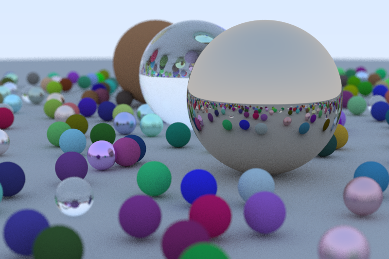
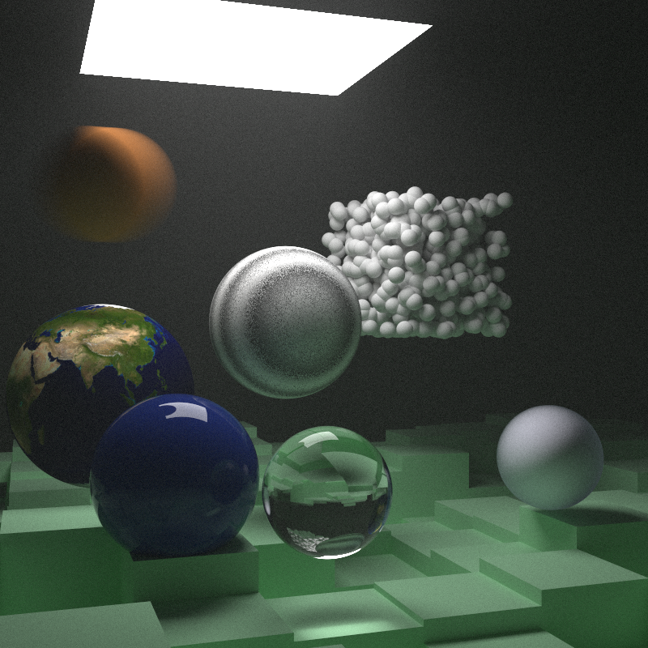
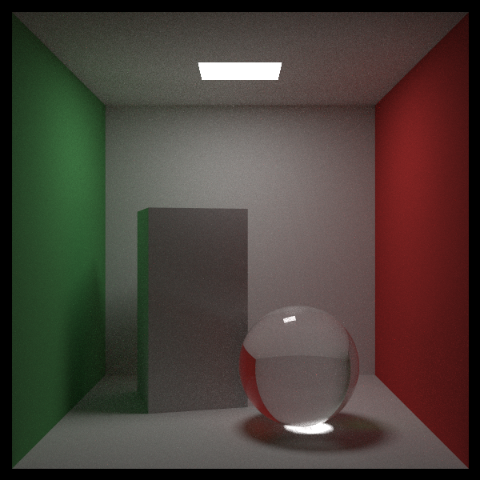

# Ray Tracing in One Weekend Series in Java

This project is a full implementation of ray tracing in one weekend series.
Java language has been chosen to avoid direct copying and enhance the learning experience.
Java is not a bad choice because of its OOP support. The series heavily uses OOP to organize its code. The caveats are no operator overloading and slow performance.

## Sample Images

